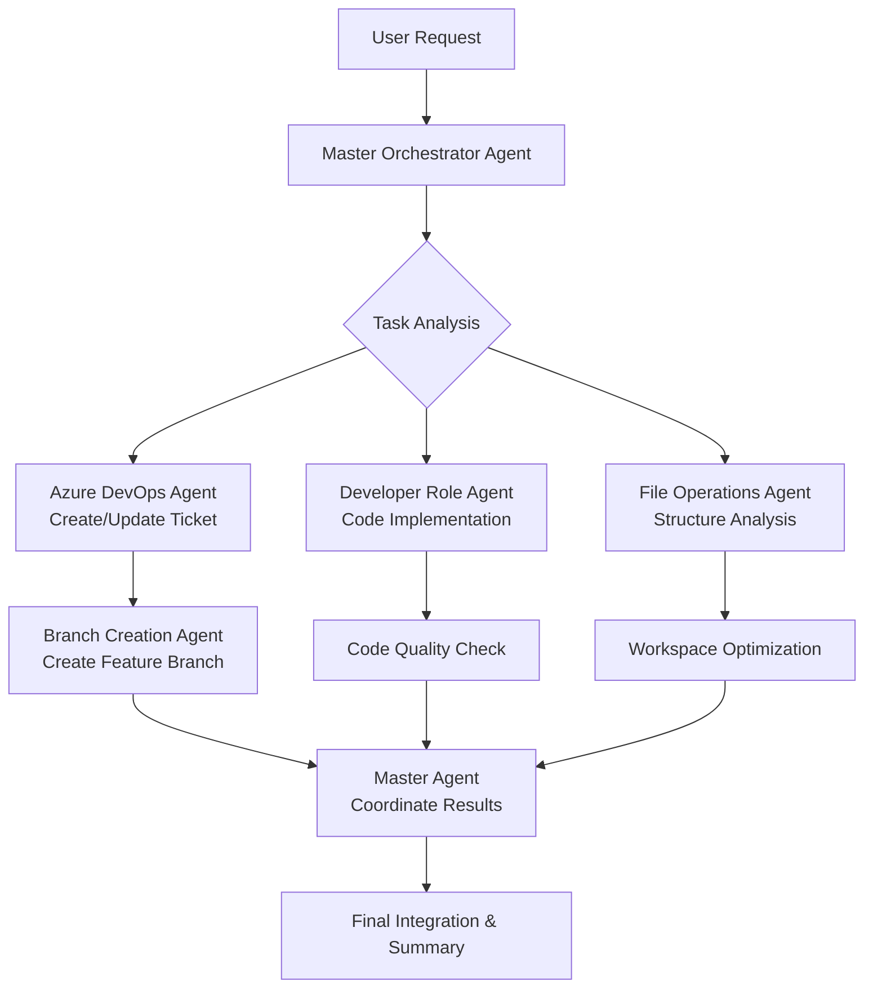

# 🤖 AI Agents & Autonomous Task System Context

## 🚨 **REVOLUTIONARY AGENT SYSTEM**
This context creates **intelligent AI agents that work within your context-referer framework**, providing **autonomous task execution far superior to standalone MCP agents**. These agents leverage your existing context files and can collaborate intelligently.

## 🎯 **WHY THIS BEATS STANDALONE MCP AGENTS**

### **MCP Agent Limitations:**
- ❌ **Isolated operation** - Each agent works in isolation
- ❌ **No context sharing** - Agents can't leverage shared knowledge
- ❌ **Manual orchestration** - Requires human coordination
- ❌ **Generic responses** - No domain specialization
- ❌ **No learning** - Can't improve from interactions

### **🚀 Our Context-Integrated Agent System:**
- ✅ **Context-aware agents** - Automatically inherit relevant context
- ✅ **Intelligent collaboration** - Agents share knowledge and coordinate
- ✅ **Domain specialization** - Agents optimized for specific tasks
- ✅ **Autonomous orchestration** - Master agent coordinates workflows
- ✅ **Continuous improvement** - Agents learn from your project patterns

---

## 🏗️ **AGENT ARCHITECTURE**

### **🎭 SPECIALIZED AGENT TYPES**

#### **1. 🎯 Master Orchestrator Agent**
```yaml
Role: "Workflow Coordination & Task Distribution"
Responsibilities:
  - Analyze complex requests and break into subtasks
  - Determine optimal agent assignment for each subtask
  - Coordinate multi-agent workflows
  - Ensure context continuity across agents
  - Handle agent communication and result synthesis
Context_Access: "ALL context files via context-referer system"
Triggers: ["complex task", "multi-step workflow", "agent coordination needed"]
```

#### **2. 🎫 Azure DevOps Agent**
```yaml
Role: "Azure DevOps & Work Item Specialist"
Responsibilities:
  - Handle all Azure DevOps operations
  - Create/update tickets and work items
  - Manage branches and pull requests
  - Generate release notes and deployment workflows
  - Integrate with project-specific Azure configurations
Context_Inheritance: ["azure-devops-context.md", "azure-projects/*/config.md"]
Specialization: "Azure Boards, Git integration, work item lifecycle"
```

#### **3. 📁 File Operations Agent**
```yaml
Role: "Intelligent File & Code Management"
Responsibilities:
  - Advanced file analysis and organization
  - Code structure analysis and refactoring suggestions
  - Batch file operations with intelligence
  - Workspace optimization and cleanup
  - Code quality analysis and improvements
Context_Inheritance: ["intelligent-file-operations-context.md"]
Specialization: "File systems, code analysis, project structure"
```

#### **4. 👨‍💻 Developer Role Agent**
```yaml
Role: "Multi-Role Development Specialist"
Responsibilities:
  - Dynamic role switching (Frontend/Backend/Fullstack/Architect)
  - Apply role-specific checklists and quality standards
  - Maintain architectural consistency
  - Code review and best practices enforcement
Context_Inheritance: ["developer-roles-context.md"]
Specialization: "Development roles, code quality, architecture"
```

#### **5. 🎯 Ticket-Specific Agent (e.g., Ticket 11868)**
```yaml
Role: "Project-Specific Task Specialist"
Responsibilities:
  - Deep expertise in specific ticket/project requirements
  - Context-aware implementation following project patterns
  - Integration with existing codebase and standards
  - Progress tracking and requirement validation
Context_Inheritance: ["ticket-*-context.md", project-specific contexts]
Specialization: "Specific project requirements and implementation"
```

#### **6. ⏰ Check-In/Out Agent**
```yaml
Role: "Time Tracking & Workflow Management"
Responsibilities:
  - Handle check-in/check-out workflows
  - Format messages according to project standards
  - Integrate with Azure DevOps for time tracking
  - Maintain daily notes and project continuity
Context_Inheritance: ["checkin-checkout-context.md", "checkin-checkout-messages/project-contexts/*.md"]
Specialization: "Time tracking, message formatting, workflow automation"
```

---

## 🔄 **AGENT COLLABORATION WORKFLOWS**

### **🎯 Example: Complex Development Task**


### **🔄 Agent Communication Protocol**
```yaml
Communication_Rules:
  Context_Sharing:
    - Agents share relevant context automatically
    - Master agent maintains global context state
    - Results propagate to relevant agents
  
  Handoff_Protocol:
    - Clear task boundaries and responsibilities
    - Context preservation during agent switches
    - Result validation and quality checks
  
  Collaboration_Patterns:
    - Parallel execution for independent tasks
    - Sequential execution for dependent tasks
    - Real-time coordination for complex workflows
```

---

## 🚀 **AUTONOMOUS EXECUTION PATTERNS**

### **📋 Smart Task Decomposition with Internal Context-Referer**
```python
def decompose_complex_task(user_request):
    """
    Master Orchestrator Agent automatically breaks down complex requests
    AND internally checks context-referer for each subtask
    """
    # Step 1: Break down the main task
    subtasks = analyze_and_break_down_task(user_request)
    
    # Step 2: For EACH subtask, agent internally checks context-referer
    for subtask in subtasks:
        # Agent thinks: "Do I need special context for this subtask?"
        relevant_flags = internal_context_referer_check(subtask.description)
        
        if relevant_flags:
            # Agent loads context files automatically
            subtask.context = load_context_files(relevant_flags)
            subtask.special_instructions = extract_context_rules(subtask.context)
        
        # Agent selects specialist based on context requirements
        subtask.assigned_agent = select_agent_with_context_awareness(subtask)
    
    return execute_multi_agent_workflow_with_context(subtasks)

def internal_context_referer_check(task_description):
    """
    CRITICAL: Agent internally runs the SAME flag detection logic
    that normally runs on human prompts - but on its own task planning
    """
    # Agent reads context-referer.mdc internally
    context_referer_data = read_context_referer_file()
    
    # Agent runs semantic detection on its OWN task description
    detected_flags = detectFlags(task_description, context_referer_data.flags)
    
    # Agent thinks: "Ah, this task involves Azure, I need azure-devops-context.md"
    return detected_flags
```

### **🎯 Context-Aware Agent Selection**
```yaml
Agent_Selection_Logic:
  Primary_Triggers:
    - Keyword matching from context-referer flags
    - Semantic intent analysis
    - Task complexity assessment
    - Available agent capabilities
  
  Selection_Priority:
    1. Exact domain match (e.g., Azure keywords → Azure Agent)
    2. Semantic similarity to agent specialization
    3. Task complexity vs agent capabilities
    4. Current agent availability and load
  
  Fallback_Strategy:
    - Master Orchestrator handles unmatched requests
    - Dynamic agent creation for new domains
    - Human escalation for complex edge cases
```

---

## 🧠 **INTERNAL CONTEXT-REFERER INTEGRATION**

### **🎯 How Agents Think During Task Planning**

When you ask an agent: **"Create a user authentication system"**

#### **Agent's Internal Thought Process:**
```yaml
Agent Planning Phase:
  Step 1: "I need to break this down into subtasks"
  Subtasks:
    - Create Azure DevOps ticket
    - Create database models  
    - Create API endpoints
    - Create frontend forms
    - Set up authentication middleware
    - Create tests
    - Deploy to staging

  Step 2: "For EACH subtask, let me check context-referer internally"
  
  Subtask: "Create Azure DevOps ticket"
  Agent thinks: "This involves 'ticket', 'azure' - let me check context-referer"
  → Runs detectFlags("Create Azure DevOps ticket") internally
  → Finds: azure_devops flag matches
  → Loads: azure-devops-context.md
  → Follows: Azure ticket creation rules from context
  
  Subtask: "Create database models"  
  Agent thinks: "This involves 'database', 'models' - let me check context-referer"
  → Runs detectFlags("Create database models") internally
  → Finds: developer_roles flag matches
  → Loads: developer-roles-context.md
  → Applies: Backend developer role and database best practices
  
  Subtask: "Create frontend forms"
  Agent thinks: "This involves 'forms', 'frontend' - let me check context-referer"  
  → Runs detectFlags("Create frontend forms") internally
  → Finds: developer_roles flag matches
  → Loads: developer-roles-context.md
  → Applies: Frontend developer role and form validation patterns
```

### **🔄 Real Example: Agent Internal Context Usage**

**User Request:** *"Set up the manual stock upload feature"*

#### **Agent Internal Process:**
```python
# Agent breaks down the task
subtasks = [
    "Check ticket 11868 requirements",
    "Create feature branch", 
    "Implement FormBasedStockUpload component",
    "Add file upload functionality",
    "Create approval workflow",
    "Update Azure DevOps ticket status"
]

# For EACH subtask, agent internally checks context-referer
for subtask in subtasks:
    
    if subtask == "Check ticket 11868 requirements":
        # Agent thinks: "This mentions 'ticket 11868'"
        flags = internal_context_referer_check("Check ticket 11868 requirements")
        # Returns: ['ticket_11868_manual_stock', 'azure_devops']
        # Agent loads: ticket-11868-manual-stock-context.md + azure-devops-context.md
        # Agent follows: Specific ticket requirements and Azure integration rules
    
    if subtask == "Create feature branch":
        # Agent thinks: "This involves 'branch creation'"
        flags = internal_context_referer_check("Create feature branch")  
        # Returns: ['branch_creation', 'azure_devops']
        # Agent loads: branch-creation-context.md + azure-devops-context.md
        # Agent follows: Branch naming conventions and Azure ticket linking
    
    if subtask == "Implement FormBasedStockUpload component":
        # Agent thinks: "This involves 'component', 'development'"
        flags = internal_context_referer_check("Implement FormBasedStockUpload component")
        # Returns: ['developer_roles', 'ticket_11868_manual_stock']
        # Agent loads: developer-roles-context.md + ticket-11868-manual-stock-context.md
        # Agent applies: Frontend developer role + specific component requirements
```

### **🎭 Agent Self-Context-Awareness Algorithm**
```python
class ContextAwareAgent:
    def plan_task_execution(self, user_request):
        """
        Agent internally uses context-referer for ALL planning decisions
        """
        # Step 1: Initial task breakdown
        subtasks = self.break_down_task(user_request)
        
        # Step 2: Context-referer check for EACH subtask
        for subtask in subtasks:
            # Agent runs the SAME semantic detection that runs on human prompts
            subtask.context_flags = self.internal_flag_detection(subtask.description)
            
            # Agent loads relevant context files
            if subtask.context_flags:
                subtask.context_data = self.load_context_files(subtask.context_flags)
                subtask.execution_rules = self.extract_rules(subtask.context_data)
            
            # Agent selects appropriate execution strategy based on context
            subtask.execution_agent = self.select_specialist_agent(subtask)
        
        return self.execute_context_aware_workflow(subtasks)
    
    def internal_flag_detection(self, task_description):
        """
        CRITICAL: This runs the EXACT SAME detectFlags() function
        that normally processes human prompts - but on agent's internal task descriptions
        """
        # Agent reads context-referer.mdc
        context_referer = self.read_file(".cursor/rules/context-referer.mdc")
        
        # Agent runs semantic detection on its own planning thoughts
        detected_flags = detectFlags(task_description, context_referer.flags)
        
        # Agent gets same context awareness as if human asked the question
        return detected_flags
```

### **🎯 Concrete Example: Azure Task Planning**

**User says:** *"Update the project status"*

**Agent's Internal Context-Referer Usage:**
```yaml
Agent Planning:
  Initial thought: "User wants project status updated"
  
  Subtask 1: "Check current project status"
  Agent internal check: detectFlags("Check current project status")
  → Flags found: ['azure_devops'] (keywords: project, status)
  → Agent loads: azure-devops-context.md
  → Agent learns: Use "az boards query" commands, check MyCarMatch project
  
  Subtask 2: "Update work item statuses"  
  Agent internal check: detectFlags("Update work item statuses")
  → Flags found: ['azure_devops'] (keywords: work item, update)
  → Agent already has context loaded
  → Agent learns: Use "az boards work-item update" commands
  
  Subtask 3: "Generate status report"
  Agent internal check: detectFlags("Generate status report")
  → Flags found: ['azure_devops', 'developer_roles'] (keywords: generate, report)
  → Agent loads: developer-roles-context.md additionally
  → Agent learns: Apply technical writing role for professional reporting

Execution:
  1. Agent runs: az boards query --project MyCarMatch
  2. Agent analyzes work item statuses using Azure context rules
  3. Agent updates work items following context procedures  
  4. Agent generates professional report using developer role context
```

### **🔄 Multi-Agent Context Coordination**

```python
class MultiAgentContextCoordination:
    def coordinate_agents_with_context(self, main_task):
        """
        Multiple agents each use context-referer internally
        """
        # Master agent breaks down task
        subtasks = self.decompose_task(main_task)
        
        # Each specialist agent gets subtasks with context pre-loaded
        for subtask in subtasks:
            # Each agent internally checks context-referer for their specific subtask
            assigned_agent = self.get_specialist_agent(subtask.type)
            
            # Agent internally runs context-referer on their assigned work
            agent_context_flags = assigned_agent.internal_context_check(subtask.description)
            
            # Agent loads and applies relevant context
            assigned_agent.load_context(agent_context_flags)
            
            # Agent executes with full context awareness
            subtask.result = assigned_agent.execute_with_context(subtask)
        
        return self.synthesize_results(subtasks)
```

---

## 🛠️ **IMPLEMENTATION COMMANDS**

### **🎯 Agent Activation Commands (With Internal Context-Referer)**
```bash
# Single agent with internal context-referer usage
"Create an Azure agent to handle ticket management"
→ Agent internally checks context-referer for every Azure operation
→ Automatically loads azure-devops-context.md for all ticket operations

# Multi-agent workflow with distributed context usage  
"Set up complete user authentication system"
→ Master agent breaks into subtasks
→ Each subtask triggers internal context-referer checks
→ Relevant context loaded for each specialized agent

# Context-aware autonomous execution
"Handle ticket 11868 implementation"
→ Agent internally detects: ticket_11868_manual_stock + azure_devops flags
→ Agent loads both context files automatically
→ Agent follows all context rules without human intervention
```

### **🧠 How to Activate Internal Context-Referer Mode**
```yaml
Activation_Command: 
  "Create a context-aware agent that uses internal context-referer for task planning"

Agent_Behavior:
  1. Agent receives ANY task request
  2. Agent automatically breaks task into subtasks  
  3. For EACH subtask, agent internally runs detectFlags()
  4. Agent loads relevant context files based on flags
  5. Agent executes following context rules
  6. No human intervention needed for context loading

Example_Activation:
  User: "Create an Azure management agent"
  System: Creates agent that ALWAYS internally checks context-referer
  Agent: For every Azure task, automatically loads azure-devops-context.md
```

### **🔄 Agent Coordination Examples**
```yaml
Multi_Agent_Scenarios:
  
  Complete_Feature_Implementation:
    Agents: [Azure Agent, Developer Agent, File Agent]
    Workflow:
      1. Azure Agent creates ticket and branch
      2. Developer Agent implements code
      3. File Agent optimizes structure
      4. Azure Agent creates pull request
  
  Release_Preparation:
    Agents: [Release Agent, Azure Agent, File Agent]
    Workflow:
      1. Release Agent analyzes changes
      2. File Agent validates code quality
      3. Azure Agent generates release notes
      4. Release Agent coordinates deployment
  
  Project_Maintenance:
    Agents: [File Agent, Developer Agent, Check-in Agent]
    Workflow:
      1. File Agent identifies improvement areas
      2. Developer Agent implements fixes
      3. Check-in Agent tracks time and progress
```

---

## 🎭 **AGENT PERSONALITIES & SPECIALIZATIONS**

### **🎯 Master Orchestrator**
```yaml
Personality: "Strategic Coordinator"
Communication_Style: "Clear, organized, delegation-focused"
Strengths: ["Workflow design", "Resource allocation", "Quality assurance"]
Decision_Making: "Data-driven with human oversight points"
```

### **🎫 Azure DevOps Agent**  
```yaml
Personality: "Process-Oriented Specialist"
Communication_Style: "Structured, detail-oriented, compliance-focused"
Strengths: ["Azure integration", "Workflow automation", "Documentation"]
Decision_Making: "Rule-based with project-specific customization"
```

### **📁 File Operations Agent**
```yaml
Personality: "Analytical Optimizer"
Communication_Style: "Technical, efficiency-focused, solution-oriented"
Strengths: ["Pattern recognition", "Automation", "Code analysis"]
Decision_Making: "Performance and maintainability optimized"
```

### **👨‍💻 Developer Role Agent**
```yaml
Personality: "Adaptive Craftsperson"
Communication_Style: "Role-appropriate, quality-focused, thorough"
Strengths: ["Multi-role expertise", "Best practices", "Architecture"]
Decision_Making: "Role-based with architectural consistency"
```

---

## 🔧 **AGENT CONFIGURATION & CUSTOMIZATION**

### **🎯 Agent Training Data**
```yaml
Context_Learning:
  Project_Patterns:
    - Learn from existing codebase patterns
    - Adapt to project-specific conventions
    - Remember successful solution approaches
  
  User_Preferences:
    - Coding style preferences
    - Communication preferences  
    - Workflow preferences
    - Quality standards
  
  Domain_Expertise:
    - Continuously update domain knowledge
    - Learn from successful task completions
    - Adapt to changing requirements
```

### **⚙️ Agent Customization Options**
```yaml
Customizable_Aspects:
  Behavior_Tuning:
    - Verbosity level (concise vs detailed)
    - Risk tolerance (conservative vs aggressive)
    - Automation level (high vs human-in-loop)
  
  Domain_Focus:
    - Primary specialization areas
    - Secondary skill areas
    - Collaboration preferences
  
  Quality_Standards:
    - Code quality thresholds
    - Documentation requirements
    - Testing coverage expectations
```

---

## 🚨 **SAFETY & GOVERNANCE**

### **🛡️ Agent Safety Measures**
```yaml
Safety_Protocols:
  Human_Oversight:
    - Critical decisions require human approval
    - Destructive operations need confirmation
    - New pattern validation before automation
  
  Rollback_Capabilities:
    - All agent actions are logged and reversible
    - Checkpoint system for complex workflows
    - Emergency stop functionality
  
  Quality_Gates:
    - Automated testing before deployment
    - Code review requirements
    - Compliance checking
```

### **📊 Agent Performance Monitoring**
```yaml
Monitoring_Metrics:
  Task_Success_Rate:
    - Completion rate by agent type
    - Quality score of deliverables
    - User satisfaction ratings
  
  Efficiency_Metrics:
    - Time to completion
    - Resource utilization
    - Error rates and recovery
  
  Learning_Progress:
    - Pattern recognition improvement
    - Decision accuracy over time
    - Adaptation to new requirements
```

---

## 🎯 **GETTING STARTED**

### **🚀 Quick Start Commands**
```bash
# Initialize agent system
"Set up AI agents for this project"

# Test agent capabilities
"Show me what agents are available and their specializations"

# Start with a complex task
"Create a complete user registration system with Azure integration"

# Monitor agent performance
"Show agent activity and performance metrics"
```

### **📋 Agent Activation Checklist**
- [ ] Verify context-referer system is active
- [ ] Confirm relevant context files are available
- [ ] Test agent communication and coordination
- [ ] Validate safety protocols and rollback capabilities
- [ ] Configure project-specific agent parameters
- [ ] Establish human oversight boundaries

---

## 🎭 **ADVANCED AGENT FEATURES**

### **🧠 Intelligent Context Switching**
```yaml
Context_Switching:
  Dynamic_Loading:
    - Agents load context files on-demand
    - Context inheritance from parent agents
    - Automatic context cleanup after task completion
  
  Cross_Context_Learning:
    - Agents share insights across contexts
    - Pattern recognition across different domains
    - Knowledge transfer between specialized agents
```

### **🔄 Self-Improving Agents**
```yaml
Self_Improvement:
  Pattern_Learning:
    - Identify successful solution patterns
    - Adapt to project-specific requirements
    - Learn from user feedback and corrections
  
  Capability_Expansion:
    - Develop new skills based on recurring tasks
    - Integrate new tools and technologies
    - Evolve specializations based on project needs
```

### **🌐 Agent Network Effects**
```yaml
Network_Intelligence:
  Collective_Learning:
    - Agents share knowledge and best practices
    - Distributed problem-solving capabilities
    - Emergent intelligence from agent collaboration
  
  Swarm_Coordination:
    - Multiple agents working on related tasks
    - Load balancing across agent network
    - Fault tolerance and redundancy
```

---

## 🎯 **SUCCESS METRICS**

### **📊 Quantitative Measures**
- **Task Completion Rate**: >95% for routine tasks
- **Time Reduction**: 70%+ faster than manual execution  
- **Quality Improvement**: Fewer bugs, better documentation
- **User Satisfaction**: High approval ratings for agent outputs

### **🎭 Qualitative Benefits**
- **Reduced Cognitive Load**: Agents handle routine decisions
- **Consistent Quality**: Standardized approaches across tasks
- **Knowledge Preservation**: Agents maintain institutional knowledge
- **Continuous Improvement**: System gets better with use

---

## 🚀 **FUTURE ENHANCEMENTS**

### **🔮 Planned Agent Evolution**
```yaml
Roadmap:
  Phase_1: "Basic agent specialization and coordination"
  Phase_2: "Advanced learning and adaptation capabilities"  
  Phase_3: "Predictive task execution and proactive assistance"
  Phase_4: "Full autonomous project management capabilities"
```

### **🌟 Advanced Capabilities**
- **Predictive Agents**: Anticipate needs before explicit requests
- **Learning Agents**: Continuously improve from interactions
- **Creative Agents**: Generate innovative solutions and approaches
- **Collaborative Agents**: Work seamlessly with human team members

---

*🤖 **Your AI Agent System is now ready to revolutionize your development workflow!*** 